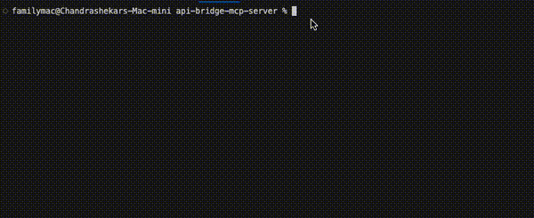
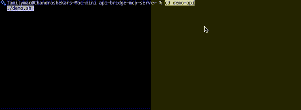
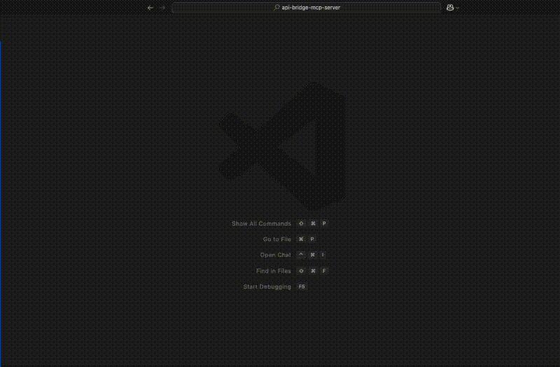
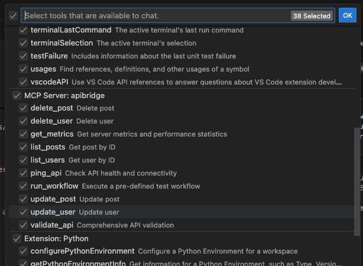

# APIBridge MCP Server

[](https://opensource.org/licenses/MIT)


An open-source Model Context Protocol server for dynamic API testing and validation powered by OpenAPI specifications.

APIBridge automatically generates MCP tools from your OpenAPI (Swagger) specification, allowing you to interact with, test, and validate your APIs using natural language. Simply provide an OpenAPI YAML or JSON file, and APIBridge creates a complete testing suite with zero configuration.

**🏗️ Foundation-First Design Philosophy:**
APIBridge is architected as a **foundational platform** that provides base workflows and core tools which you can extend, customize, and enhance. Rather than being a rigid solution, it serves as extensible building blocks for your specific API integration needs.

---

## Quick Start


1.  **Install dependencies:**
    ```bash
    npm install
    ```
    

2.  **Start the demo API server:**
    ```bash
    cd demo-api
    ./demo.sh
    ```
    

3.  **Run MCP of the demo API:**
    ```bash
    node index.js demo-api/sample-api.yml
    ```
    


4.  **Add the MCP server to VS Code (Example)**

      You can quickly add the MCP server to VS Code:
      1. Press <kbd>Cmd</kbd>+<kbd>Cmd</kbd>+<kbd>Shift</kbd>+<kbd>P</kbd> (or <kbd>Ctrl</kbd>+<kbd>Shift</kbd>+<kbd>P</kbd> on Windows/Linux) to open the Command Palette.
      2. Type `MCP: Open User Configuration` and select it.
      3. Add your MCP configuration as shown below.
      4. Save the file.
      5. Click on Start

      The foundation workflows will be automatically generated and ready for extension!

      👉 For the full MCP config JSON example, see the [VS Code Configuration](#vs-code-configuration) section below.

      


## MCP in Action

Once your APIBridge MCP Server is running, you can connect to it from any compatible client (like VS Code or Claude Desktop) to interact with your API using natural language. The video below demonstrates how APIBridge can run a comprehensive suite of tests against a demo API, from checking the API health and metrics to validating CRUD operations for different endpoints. It intelligently identifies issues, such as a failing create_product operation, and then automatically generates a detailed report in Markdown format, summarizing the status of the entire system. This entire workflow is executed through a series of simple, conversational prompts, showcasing the power of using a 100% local, open-source MCP server to streamline API testing and validation.


---

## Getting Started

#### 1. Prerequisites

-   [Node.js](https://nodejs.org/) (v18.0.0 or higher)
-   [npm](https://www.npmjs.com/) (included with Node.js)

#### 2. Installation

Clone or download the project files, then install the required dependencies:
```bash
npm install
```

#### 3. Usage

The server can be used in several ways:

**With OpenAPI Specification (Recommended):**
```bash
# Using OpenAPI YAML file
node index.js demo-api/sample-api.yml

# With custom base URL
node index.js demo-api/sample-api.yml --base-url http://localhost:8080/api

# With API key authentication
node index.js demo-api/sample-api.yml --api-key your-api-key-here

# Enable verbose logging
node index.js demo-api/sample-api.yml --verbose
```

**With Configuration File:**
```bash
# Use custom configuration file
node index.js --config apibridge.config.json

# Combine with OpenAPI spec
node index.js api.yml --config apibridge.config.json
```

**Command Line Options:**
-   `--openapi, -o`: OpenAPI specification file (YAML or JSON)
-   `--config, -c`: Configuration file (default: apibridge.config.json)
-   `--base-url, -b`: Base URL for the API
-   `--api-key, -k`: API key for authentication
-   `--verbose, -v`: Enable verbose logging
-   `--help, -h`: Show help message

#### 4. Quick Demo Setup

For a complete demo with a working API backend:

```bash
# Run the demo script (starts demo API server + shows instructions)
cd demo-api
./demo.sh
```

Or manually:

```bash
# Terminal 1: Start the demo API server
cd demo-api
npm install
npm start

# Terminal 2: Start the MCP server
node index.js demo-api/sample-api.yml
```

#### 5. Running the Server

To start the MCP server, run:
```bash
node index.js demo-api/sample-api.yml
```

The server will start and listen for requests from an MCP client on `stdio`.

---

## Features

-   **OpenAPI-Powered**: Automatically generates tools from OpenAPI/Swagger specifications (YAML or JSON).
-   **Zero Configuration**: Just provide your OpenAPI spec and start testing immediately.
-   **Foundation Workflows**: Provides base CRUD workflows that can be extended and enhanced for specific use cases.
-   **Dynamic Tool Generation**: Automatically creates tools like `create_user`, `list_users`, etc., from your API endpoint configuration.
-   **Extensible Architecture**: Built-to-be-extended design allows customization of workflows, authentication, and tool generation.
-   **Smart Relationship Detection**: Automatically detects and handles foreign key relationships between API resources.
-   **Real-time Validation**: Includes built-in tools to ping API health (`ping_api`) and run comprehensive validation tests (`validate_api`).
-   **Context-Aware Testing**: Save responses and use them in subsequent requests for complex testing scenarios.
-   **Built-in Metrics**: Get server uptime, request counts, and average response times with the `get_metrics` tool.

---

## Project Structure

```
/your-project
├── index.js              # The main server entry point
├── package.json          # Project definition and dependencies
├── README.md             # This file
├── LICENSE               # The MIT License with Commercial Enterprise Addendum
├── /src/                 # Source code directory
│   ├── /api/             # Main server implementation
│   ├── /auth/            # Authentication utilities
│   ├── /config/          # Configuration management
│   ├── /docs/            # Documentation utilities
│   ├── /services/        # Core services (OpenAPI parser, etc.)
│   ├── /tools/           # Tool management and generation
│   └── /utils/           # Utility functions
├── /test/                # Test files
│   └── workflow-generator.test.js # Main test file
├── /demo-api/            # Demo API server with sample OpenAPI spec
│   ├── server.js         # Express server implementing sample-api.yml
│   ├── package.json      # Demo API dependencies
│   ├── sample-api.yml    # Example OpenAPI specification
│   ├── demo.sh           # Demo script for this API server
│   └── README.md         # Demo API documentation
└── /logs/                # (Auto-generated) For log files
```

---

## Testing and Validation

APIBridge includes a comprehensive test suite with sample APIs from different domains to validate workflow generation.

### Testing Your OpenAPI Specification

Before starting the MCP server, you can validate your OpenAPI specification to ensure it is correctly formatted and will generate the expected workflows. We have included a test script that you can run from the command line.

To test your OpenAPI file, run the following command:

```bash
npm test -- /path/to/your/openapi.yml
```

Replace `/path/to/your/openapi.yml` with the actual path to your OpenAPI specification file. The script will parse the file, generate the endpoints and workflows, and report any errors it finds.

If the script runs successfully, you will see a confirmation message indicating that your OpenAPI specification is valid and ready to be used with the APIBridge MCP Server.

### Running the Full Test Suite

```bash
# Run the full test suite
node test/workflow-generator.test.js

# Test specific API domains
node test/workflow-generator.test.js test/sample-ecommerce-api.yml
node test/workflow-generator.test.js test/sample-library-api.yml
node test/workflow-generator.test.js test/sample-healthcare-api.yml

# Test your own API
node test/workflow-generator.test.js path/to/your-api.yml
```

**Available Test APIs:**
-   **E-commerce**: Complex inventory, orders, payments, and analytics
-   **Library Management**: Books, authors, borrowers, and loan workflows
-   **Healthcare**: Patient records, appointments, and medical data
-   **Demo API**: Users, posts, and products with foreign key relationships

For detailed testing documentation, see [`test/README.md`](test/README.md).

---

## Configuration

### Configuration File: `apibridge.config.json`

The `apibridge.config.json` file is used to configure the APIBridge MCP Server. It allows you to specify settings such as:

-   `apiBaseUrl`: The base URL of the API to connect to
-   `name`/`version`: Server name and version
-   `timeout`, `retryAttempts`: Request timeout and retry settings
-   `enableLogging`, `enableMetrics`: Enable/disable logging and metrics
-   `endpoints`, `workflows`: Custom endpoints and workflows (optional)

This file makes it easy to change server behavior, API targets, and workflow definitions without modifying code. It is especially useful for demos, CI/CD, or switching between different API environments.

**Example:**
```json
{
  "name": "APIBridge Demo MCP Server",
  "version": "1.0.0",
  "apiBaseUrl": "http://localhost:3000/api",
  "timeout": 10000,
  "retryAttempts": 3,
  "enableLogging": true,
  "enableMetrics": true,
  "endpoints": {},
  "workflows": {}
}
```

You can specify a custom config file with:
```bash
node index.js --config apibridge.config.json
```

### Configuring MCP Clients

To use this server with MCP clients like Claude Desktop or VS Code, you need to configure the client to recognize and connect to your APIBridge server.

#### Claude Desktop Configuration

1.  **Locate your Claude Desktop configuration file:**
    -   **macOS**: `~/Library/Application Support/Claude/claude_desktop_config.json`
    -   **Windows**: `%APPDATA%\Claude\claude_desktop_config.json`
    -   **Linux**: `~/.config/claude/claude_desktop_config.json`

2.  **Add the APIBridge server to your configuration:**
    ```json
    {
      "mcpServers": {
        "apibridge": {
          "command": "node",
          "args": ["/path/to/your/api-bridge-mcp-server/index.js", "demo-api/sample-api.yml"],
          "env": {
            "NODE_ENV": "production"
          }
        }
      }
    }
    ```

3.  **For a more advanced configuration with a custom API:**
    ```json
    {
      "mcpServers": {
        "my-api-bridge": {
          "command": "node",
          "args": [
            "/path/to/your/api-bridge-mcp-server/index.js", 
            "/path/to/your/openapi-spec.yml",
            "--base-url", "https://api.yourcompany.com",
            "--api-key", "your-api-key-here"
          ],
          "env": {
            "NODE_ENV": "production"
          }
        }
      }
    }
    ```

4.  **Restart Claude Desktop** for the changes to take effect.


#### VS Code Configuration

👉 See [Quick Start Step 4](#add-the-mcp-server-to-vs-code-example) above for a fast walkthrough of adding the MCP server to VS Code.

You can add the MCP server to VS Code in just a few steps:

1. Press <kbd>Cmd</kbd>+<kbd>Cmd</kbd>+<kbd>Shift</kbd>+<kbd>P</kbd> (or <kbd>Ctrl</kbd>+<kbd>Shift</kbd>+<kbd>P</kbd> on Windows/Linux) to open the Command Palette.
2. Type `MCP: Open User Configuration` and select it.
3. Add your MCP configuration as shown below and save the file:

    ```json
    {
      "inputs": [
        {
          "type": "promptString",
          "id": "api-base-url",
          "description": "API Base URL (optional)",
          "default": "http://localhost:3000/api"
        },
        {
          "type": "promptString",
          "id": "api-key",
          "description": "API Key (optional)",
          "password": true
        }
      ],
      "servers": {
        "apibridge": {
          "type": "stdio",
          "command": "node",
          "args": ["/path/to/your/api-bridge-mcp-server/index.js", "demo-api/sample-api.yml"],
          "cwd": "/path/to/your/api-bridge-mcp-server",
          "env": {
            "API_BASE_URL": "${input:api-base-url}",
            "API_KEY": "${input:api-key}"
          }
        }
      }
    }
    ```

4. You will see your tools in the available tools panel:
    

**Key Features:**
- Secure input prompts for credentials
- Environment variables for API settings
- Flexible and type-safe configuration

#### Other MCP Clients

For other MCP-compatible clients, the general pattern is:
-   **Command**: `node`
-   **Arguments**: `["/path/to/api-bridge-mcp-server/index.js", "your-openapi-spec.yml"]`
-   **Working Directory**: `/path/to/api-bridge-mcp-server`
-   **Protocol**: stdio

#### Verification

Once configured, you should be able to:
1.  See the APIBridge tools available in your MCP client.
2.  Use tools like `ping_api`, `validate_api`, and dynamically generated endpoint tools.
3.  Test your APIs through natural language interactions.

**Example tools you'll see:**
-   `ping_api` - Check API health
-   `validate_api` - Run comprehensive API tests
-   `list_users` - Get all users (if your API has this endpoint)
-   `create_user` - Create a new user
-   `get_metrics` - View server statistics

---

## Extensibility Guide

APIBridge is designed as a **foundational platform** that provides base workflows and core functionality that you can build upon. The architecture embraces extensibility at every level, allowing you to customize and enhance the system to meet your specific requirements.

### Foundation Concept

APIBridge provides these **base building blocks**:

1.  **Core CRUD Workflows**: Basic Create, Read, Update, Delete operations that can be enhanced.
2.  **Base Tool Generation**: Foundational tool creation from OpenAPI specs that can be customized.
3.  **Authentication Framework**: Basic auth support that can be extended for complex scenarios.
4.  **Relationship Detection**: Smart foreign key handling that can be enhanced for complex data relationships.
5.  **Testing Infrastructure**: Basic validation tools that can be extended for comprehensive testing suites.

**Extensibility Philosophy:**
-   **Start with the foundation** → Use base workflows as-is for rapid prototyping.
-   **Extend selectively** → Add only the customizations you need.
-   **Build incrementally** → Layer additional functionality on top of base workflows.
-   **Share enhancements** → Contribute back to the community.

### 1. Adding New Core Tools

Core tools are custom tools that are not generated from an OpenAPI specification. You can add your own tools by following these steps:

1.  **Open `src/tools/tool-manager.js`**.
2.  **In the `setupCoreTools` method, add a new entry to the `this.coreTools` map.**

    ```javascript
    this.coreTools.set('my_custom_tool', {
      name: 'my_custom_tool',
      description: 'A new tool that does something awesome.',
      inputSchema: {
        type: 'object',
        properties: {
          my_arg: { type: 'string', description: 'An argument for my tool' }
        }
      },
      handler: this.handleMyCustomTool.bind(this)
    });
    ```

3.  **Add the handler method to the `ToolManager` class.**

    ```javascript
    async handleMyCustomTool(args, testContext, metrics) {
      // Your tool's logic here
      const myArg = args.my_arg;
      // ...
      return {
        content: [{
          type: 'text',
          text: `My custom tool ran with arg: ${myArg}`
        }]
      };
    }
    ```

### 2. Extending Base Workflows

The generated workflows serve as foundational building blocks that you can extend and enhance:

**Base Workflow Examples:**
-   `users_crud_workflow` - Basic user management operations
-   `posts_crud_workflow` - Basic post content operations
-   `products_crud_workflow` - Basic product catalog operations

**Extension Strategies:**

1.  **Add Pre/Post Processing Steps:**
    ```javascript
    // In src/services/openapi-parser.js
    generateWorkflows() {
      const baseWorkflows = this.generateBaseWorkflows();
      
      // Extend workflows with custom steps
      baseWorkflows.users_crud_workflow.steps.unshift({
        action: 'validate_user_permissions',
        // ... custom validation logic
      });
      
      return baseWorkflows;
    }
    ```

2.  **Create Composite Workflows:**
    ```javascript
    // Combine base workflows for complex operations
    const complexWorkflow = {
      name: 'user_onboarding_workflow',
      steps: [
        ...baseWorkflows.users_crud_workflow.steps,
        { action: 'send_welcome_email' },
        { action: 'setup_default_preferences' },
        { action: 'assign_default_role' }
      ]
    };
    ```

3.  **Domain-Specific Extensions:**
    ```javascript
    // Extend for e-commerce scenarios
    const ecommerceWorkflows = {
      ...baseWorkflows,
      order_fulfillment_workflow: {
        steps: [
          { action: 'validate_inventory' },
          ...baseWorkflows.products_crud_workflow.steps,
          { action: 'process_payment' },
          { action: 'schedule_shipping' }
        ]
      }
    };
    ```

**Workflow Extension Guidelines:**
-   **Build on base workflows** rather than replacing them entirely.
-   **Maintain backward compatibility** when possible.
-   **Document your extensions** for team collaboration.
-   **Test extended workflows** thoroughly.
-   **Consider contributing** useful extensions back to the project.

### 3. Customizing Authentication

The server's authentication logic is centralized in `src/utils/http-client.js`. You can easily modify this file to support different authentication schemes.

-   **Bearer Token**: Supported by default via the `--api-key` flag or `API_KEY` environment variable.
-   **Custom Headers & OAuth 2.0**: We have provided examples in `src/auth/auth-examples.js`. You can import and use these functions in `src/utils/http-client.js` to extend the authentication capabilities.

**Example: Implementing Custom Header Auth**

In `src/utils/http-client.js`:

```javascript
import { setupCustomHeaderAuth } from '../auth/auth-examples.js';

// ... inside the HttpClient class, in the initialize() method

// Add this line to use a custom header
setupCustomHeaderAuth(this.client, config.apiKey, 'X-My-Custom-Header');
```

### 4. Customizing OpenAPI Tool Generation

You can change how tools are generated from an OpenAPI specification by modifying the following files:

-   **`src/services/openapi-parser.js`**: Modify this file to change how the OpenAPI specification is parsed and interpreted. For example, you could change how endpoint names are extracted or how test data is generated.
-   **`src/tools/tool-manager.js`**: Modify the `generateToolName`, `generateToolDescription`, or `generateToolSchema` methods to change how the parsed OpenAPI data is converted into MCP tools.

---

## Building on the Foundation

APIBridge is intentionally designed as a **foundation** rather than a complete solution. This approach provides several benefits:

### Foundation Benefits

1.  **Rapid Prototyping**: Use base workflows to quickly test API concepts.
2.  **Incremental Enhancement**: Add complexity only where needed.
3.  **Consistent Base**: Standard CRUD operations work the same across different APIs.
4.  **Extensibility**: Build sophisticated workflows on proven foundations.
5.  **Community Growth**: Share and reuse workflow extensions.

### Common Extension Patterns

**Pattern 1: Industry-Specific Workflows**
```bash
# Start with base
node index.js your-api.yml

# Extend for healthcare, e-commerce, finance, etc.
# Add domain-specific validation, compliance, workflows
```

**Pattern 2: Integration Workflows**
```bash
# Combine multiple APIs using base workflows
# Add orchestration between different services
# Create composite operations across systems
```

**Pattern 3: Advanced Testing Workflows**
```bash
# Build on base validation tools
# Add performance testing, load testing
# Create comprehensive test suites
```

### Contributing Back

We encourage users to:
-   **Share useful workflow extensions** with the community.
-   **Contribute authentication adapters** for different services.
-   **Submit OpenAPI parsing improvements** for edge cases.
-   **Document extension patterns** for others to learn from.

The goal is to build a rich ecosystem of extensions while maintaining a solid, reliable foundation that works consistently across different use cases.

### Getting Started with Extensions

1.  **Start Simple**: Use base workflows as-is to understand the foundation.
2.  **Identify Gaps**: Note where your specific use case needs enhancement.
3.  **Extend Incrementally**: Add one enhancement at a time.
4.  **Test Thoroughly**: Ensure extensions don't break base functionality.
5.  **Document Well**: Help others understand your extensions.
6.  **Share Value**: Consider contributing useful patterns back.

Remember: The foundation is designed to handle the common cases well, while giving you the flexibility to handle the unique aspects of your specific requirements.

---

## Troubleshooting

-   **Server not appearing**: Check that the file paths in your configuration are absolute and correct.
-   **Permission errors**: Ensure the MCP client has permission to execute Node.js and access your files.
-   **API connection issues**: Verify your API base URL and authentication credentials are correct.
-   **Logs**: Check the `logs` directory for detailed error information.
-   **Workflow generation issues**: Use the test suite to validate your API follows expected patterns.
